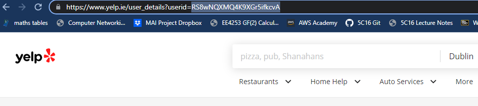

# Yelp Scrapper 
The yelp_scraper.py script takes in a user id from yelp,
as can be seen by the url after clicking on a reviewer. It is necessary for
reviewers to have ten more reviews than the specified amount of reviews as some
businesses dail to appear with the business search query in yelp's api.

The output CSV file returned by the script is in the order  
*user id, review score, business name, JSON string of business details*
